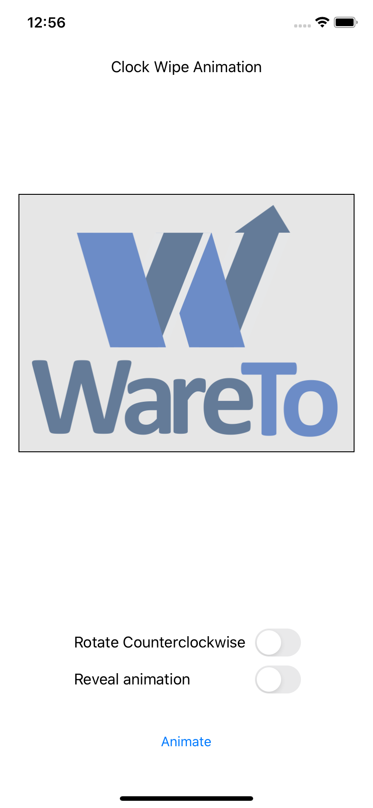

This project demonstrates how to create a "Clock Wipe" animation using a CAShapeLayer and a CABasicAnimation.

It creates and installs a CAShapeLayer as a mask on an image view's content layer. The shape layer contains a full-circle arc with a line thickness that is half as wide as the diagonal measure of the image view, so stroking the arc completely fills the image view's bounds.

`CAShapeLayer` has strokeStart and strokeEnd properties which both range from 0 to 1. if `strokeStart = 0 and strokeEnd = 1`, the entire shape is drawn. `strokeStart = 0 and strokeEnd = 0.5, the second half of the animation is drawn.  By creating a CABasicAnimation that animates the strokeEnd property from 1 to 0, the shape starts out filling the mask layer with opaque pixels, and as tehe strokeEnd value decreases towards 0, less of the circle is drawn. The transparent parts of the mask hide that part of the image view that is being masked.

The demo app has switches that let you control whether the animation hides or reveals the underlying image, and whether the transition proceeds clockwise or counter-clockwise.

The animation looks like this when set to a clockwise hide animation:

